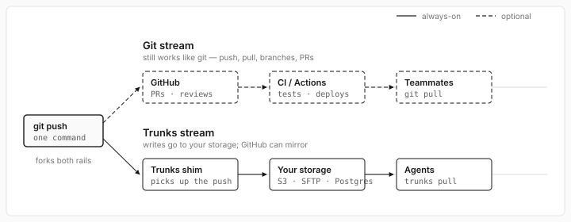
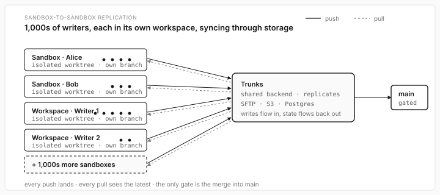

# Trunks

Git repos backed by your own storage. Run `trunks`, keep using `git`, and pushes go to S3, R2, Tigris, MinIO, Postgres, SFTP, local disk, or a file share. GitHub still works too if you want it, as a mirror.



## Use Cases

- Run agents in short-lived sandboxes and save their work before the sandbox is destroyed.
- Let one agent push work and another agent pull it on a different machine.
- Sync repo state to S3, R2, Tigris, MinIO, Postgres, SFTP, local disk, or a file share.
- Keep customer code in your own bucket, VPC, or enterprise storage.
- Mirror finished work to GitHub for PRs and review when you are ready.

## Install

```bash
pip install trunks
```

## 60-second start (local disk, no cloud)

```bash
cd myrepo
trunks init
trunks storage add --name primary --backend local --path ~/trunks-store

git checkout -b feature/auth
git add . && git commit -m "fix auth"
git push
```

That push lands in `~/trunks-store/trunks/myrepo.trunk/`. No origin needed.

## Cloud start (S3, R2, Tigris, MinIO)

```bash
export AWS_ACCESS_KEY_ID=...
export AWS_SECRET_ACCESS_KEY=...
export AWS_REGION=us-east-1

cd myrepo
trunks init
trunks storage add --name primary --backend s3 --bucket my-bucket
```

Here is what happens:

1. Trunks turns the repo name into a path: `myrepo` becomes `s3://my-bucket/trunks/myrepo.trunk`.
2. It does a real read, write, and list on the bucket to make sure the credentials work.
3. It saves the target locally in `.trunks/myrepo.trunk`.

Credentials stay local. If you pass inline flags like `--access-key`, `--secret-key`, or `--password`, Trunks saves them only in the local `.trunks/<repo>.trunk` database, masks them in `trunks storage show`, and never writes them to the remote backend. You can also use env vars, CI secrets, IAM roles, or your SSH agent instead.

Now use git like you always do:

```bash
git checkout -b feature/auth
git add . && git commit -m "fix auth"
git push
```

The push lands in `s3://my-bucket/trunks/myrepo.trunk/`.

## Multi-machine handoff



One sandbox pushes a branch. Another sandbox pulls it, keeps working, pushes back. The map of which storage holds what lives inside the trunk, so a fresh sandbox only needs the primary URL to find the mirrors.

## Multiple accounts, multiple buckets

Per-storage env vars beat the globals. This is how CI runs against more than one account at once:

```bash
export TRUNKS_STORAGE_PRIMARY_ACCESS_KEY=AKIA...
export TRUNKS_STORAGE_PRIMARY_SECRET_KEY=...
export TRUNKS_STORAGE_BACKUP_ACCESS_KEY=AKIA...    # different account
export TRUNKS_STORAGE_BACKUP_SECRET_KEY=...
```

Each named storage looks up `TRUNKS_STORAGE_<NAME>_<KEY>` first, then falls back to the provider defaults like `AWS_*` or `R2_*`.

## Mirrors

Push to more than one place at the same time:

```bash
trunks storage add --name primary --backend s3  --bucket company-primary
trunks storage add --name backup  --backend r2  --bucket company-backup --account-id $R2_ACCOUNT_ID --mirror
trunks storage add --name nas     --backend local --path /mnt/company/trunks --mirror
```

Pushes are strict. If `backup` is down, the push fails. No silent half-syncs.

## Storage health

```bash
trunks storage list
trunks storage show primary         # masks secrets
trunks storage ping                 # primary + mirrors
trunks storage ping primary
trunks storage ping s3://my-bucket  # test before saving
```

## Storage layout

- Backend: the storage root, like `s3://company-code`.
- Trunk: one repo inside that backend, like `s3://company-code/trunks/lazy-lms.trunk/`.

Trunks stores git-compatible blobs, trees, commits, and refs. The on-disk layout is its own: objects are content-addressed and shared across branches, segments are batched, large blobs are chunked, every read is hash-verified. Not git LFS. GitHub can still be a mirror for review; Trunks keeps the repo data in the storage you chose.

## CLI

| Command | What it does |
|---|---|
| `trunks` | drop into the managed shell |
| `trunks init` | create `.trunks/<repo>.trunk` locally |
| `trunks storage add --name <name> --backend <type> ...` | connect a named primary |
| `trunks storage add ... --mirror` | add a mirror |
| `trunks storage list` | list the storage you have |
| `trunks storage show <name>` | show one target with secrets masked |
| `trunks storage ping [<name>]` | check the primary and the mirrors |
| `trunks storage remove <name>` | drop a target |
| `trunks status` | repo, branch, storage, mirrors, dirty state |
| `trunks push` / `pull` / `fetch` | sync with the storage you have |
| `trunks check [--clean]` | verify the local repo and optionally GC dead objects |

Inside `trunks`, use git the normal way: `git status`, `git add`, `git commit`, `git push`.

## Backends

| Backend | URL form | Setup |
|---|---|---|
| S3 | `s3://bucket/path` | [docs/backends/s3.md](https://github.com/layerbrain/trunks/blob/main/docs/backends/s3.md) |
| MinIO | `s3://bucket --endpoint http://host:9000` | [docs/backends/s3.md](https://github.com/layerbrain/trunks/blob/main/docs/backends/s3.md#minio) |
| Cloudflare R2 | `r2://bucket/path` | [docs/backends/s3.md](https://github.com/layerbrain/trunks/blob/main/docs/backends/s3.md#cloudflare-r2) |
| Tigris | `tigris://bucket` | [docs/backends/s3.md](https://github.com/layerbrain/trunks/blob/main/docs/backends/s3.md#tigris) |
| Backblaze B2 | `b2://bucket` | [docs/backends/s3.md](https://github.com/layerbrain/trunks/blob/main/docs/backends/s3.md#backblaze-b2) |
| Wasabi | `wasabi://bucket` | [docs/backends/s3.md](https://github.com/layerbrain/trunks/blob/main/docs/backends/s3.md#wasabi) |
| DigitalOcean Spaces | `spaces://bucket` | [docs/backends/s3.md](https://github.com/layerbrain/trunks/blob/main/docs/backends/s3.md#digitalocean-spaces) |
| Azure Blob | `azure://account/container/path` | [docs/backends/azure.md](https://github.com/layerbrain/trunks/blob/main/docs/backends/azure.md) |
| GCS | `gcs://bucket/path` | [docs/backends/gcs.md](https://github.com/layerbrain/trunks/blob/main/docs/backends/gcs.md) |
| SFTP | `sftp://user@host/path` | [docs/backends/sftp.md](https://github.com/layerbrain/trunks/blob/main/docs/backends/sftp.md) |
| Postgres | `postgres://user:pw@host/db/trunks/repo.trunk` | [docs/backends/postgres.md](https://github.com/layerbrain/trunks/blob/main/docs/backends/postgres.md) |
| Local disk | `local:///path/to/dir` | [docs/backends/local.md](https://github.com/layerbrain/trunks/blob/main/docs/backends/local.md) |
| NFS / SMB | `file:///mnt/share` | [docs/backends/local.md](https://github.com/layerbrain/trunks/blob/main/docs/backends/local.md) |
| Memory (tests) | `memory://` | [docs/backends/memory.md](https://github.com/layerbrain/trunks/blob/main/docs/backends/memory.md) |

## Python

```python
from trunks import Trunk

with Trunk(backend="s3://company-code", name="lazy-lms") as trunk:
    trunk.pull()
    print(trunk.read("README.md"))
```

Async works too. The methods notice a running event loop and pick sync or async on their own:

```python
import asyncio
from trunks import Trunk

async def serve_file(path: str) -> bytes:
    async with Trunk(backend="s3://company-code", name="lazy-lms") as trunk:
        await trunk.pull()
        return await trunk.read(path)

asyncio.run(serve_file("README.md"))
```

## License

MIT.
